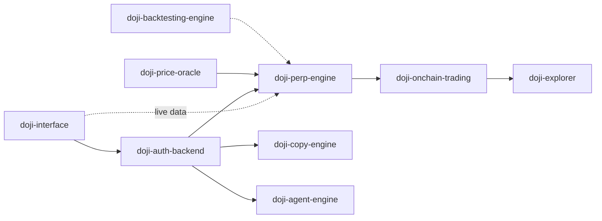

# DojiFunded

A crypto perpetual-futures prop-trading platform on Arbitrum One.

Site: https://dojifunded.com · App: https://app.dojifunded.com

---

## Overview

DojiFunded is a funded-trader platform for crypto perpetuals. A trader takes an evaluation challenge, trades the major perp markets, and on reaching the profit objective within the risk limits earns a funded account. Profit withdrawals are settled on-chain in USDC on Arbitrum.

The platform pairs a trading terminal with on-chain proof of results: any result can be minted as a tamper-proof certificate (entry/exit, PnL, fees), so a trader's track record is verifiable and portable.

## What it does

- Evaluation programs: Instant Funding, 1-Step, 2-Step Classic, 2-Step Elite, across $1,000–$100,000 account sizes.
- On-chain settlement: profit withdrawals paid in USDC on Arbitrum.
- Result certificates: mintable, tamper-proof NFTs of a trade or account result.
- AI assistant: in-app agent for market and performance analysis.
- Growth: copy trading, affiliate / KOL share-links, referral rewards.
- UX: TradingView charts, wallet onboarding (SIWE) + email, USDC funding.

## Architecture (high level)

Illustrative — adjust arrows to match the actual wiring.



## Repositories

### Trading core

| Repo | Description | Stack |
|---|---|---|
| doji-perp-engine | Core trading engine — order/position handling, account accounting, and risk-rule enforcement. | Rust |
| doji-price-oracle | Market data service — live pricing and OHLC chart history. | Rust |
| doji-onchain-trading | On-chain contracts — custody, USDC payouts, and trade-result certificates. | Solidity |

### Applications & services

| Repo | Description | Stack |
|---|---|---|
| doji-interface | Trader web app — trading terminal, dashboard, onboarding. | React + Vite (TS) |
| doji-auth-backend | Core backend — accounts, payments & funding, challenge lifecycle, growth features. | TypeScript |
| doji-explorer | Public explorer for on-chain trade certificates. | React + Vite (TS) |
| doji-copy-engine | Copy-trading service. | Node (TS) |
| doji-agent-engine | AI trading-assistant service. | Node (TS) |
| doji-backtesting-engine | Strategy backtesting. | Rust |

## Tech stack

- Core: Rust (engine, market data, backtesting) · Solidity (contracts)
- Applications: TypeScript — React + Vite (web) · Express / Fastify (services)
- Chain: Arbitrum One · USDC settlement
- Auth: wallet sign-in (SIWE) + email
- Charts: TradingView Advanced Charts

## Getting started

Each repo has its own README with exact commands. Prerequisites across the stack:

- Rust (stable) + Cargo — engine, market data, backtesting
- Node 20+ and pnpm (or npm) — web apps and TS services
- Foundry (forge / cast) — Solidity contracts
- An Arbitrum One RPC URL and a funded test wallet — for contract / integration work

Typical flow:

```bash
git clone https://github.com/<org>/<repo>.git
cd <repo>
# follow that repo's README for install, env, and run steps
```

## Configuration

Services read config from environment variables (`.env`, not committed). Expect at minimum: chain / RPC settings (Arbitrum One), contract addresses, price-feed sources, database connection strings, and third-party API keys. See each repo's `.env.example`.

## Contributing

Branch / PR conventions and internal guidelines: _[link]_. Open a PR against the relevant repo; CI must pass before review.

## License

Proprietary — © DojiFunded. All rights reserved. No copying, modification, or redistribution without written permission. Keep these repositories private.

## Codebase access

The repositories are private. Investors, partners, and prospective customers can request read access for evaluation — email [Business@dojifunded.com](mailto:Business@dojifunded.com) with your GitHub username and a short note on who you are and what you're evaluating. Access is granted per person, read-only, to selected repositories, and under NDA.

## Contact

[Business@dojifunded.com](mailto:Business@dojifunded.com)

---

